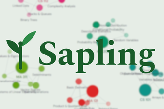
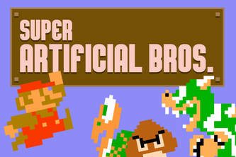
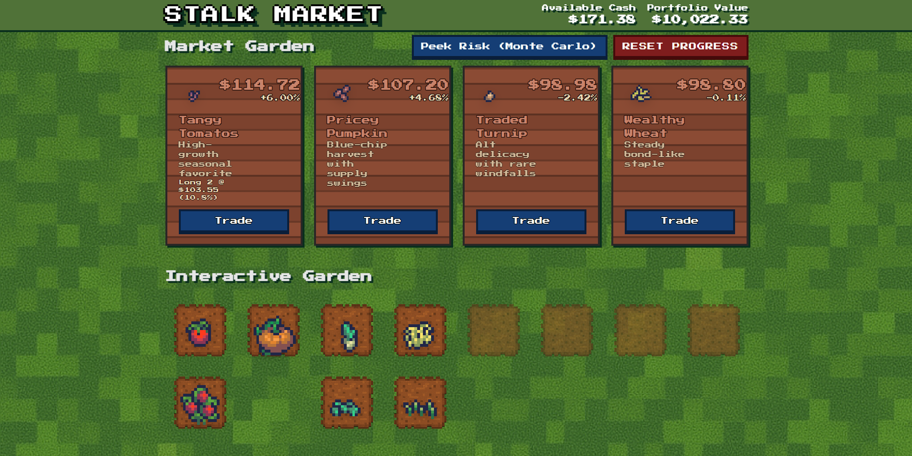

# 👋 Hey there, I'm Jack He

# About Me
<small>I'm a Computer Science and Data Science student @ Boston University, currently working in Full-Stack Development and AI/Machine Learning. There are infinite problems in the real world. Still, I aim to simplify them one step at a time through fun, interactive experiences/visuals that more of the general audience can understand.</small>

# ✏️ What I'm Currently Doing
<ul>
  <li>Building the Sapling campaign to prepare for the first beta release</li>
  <li>Learning more about full stack development</li>
  <li>Studying system design & architecture</li>
</ul>

# 💻 Project Showcase

<!-- ───────────── PROJECT 1 ───────────── -->
<table width="100%" border="0" cellspacing="0" cellpadding="0" style="border-collapse:collapse;border:none">
  <tr>
    <td valign="top" width="260" style="padding-top:0;border:none">
      
      

        
        
        
        
        
        
        
        
      

      

        <a href="https://github.com/SaplingLearn/Sapling"><b>View Project →</b></a> &nbsp;
        <a href="https://saplinglearn.com"><b>Website →</b></a>
      

    </td>
    <td valign="top" style="padding-top:0;padding-left:16px;border:none">
      <h3 style="margin-top:0;margin-bottom:2px;font-size:1.6em">🌱 Sapling - Best AI in Education, BU CivicHacks 2026</h3>
      <h4 style="margin-top:0;margin-bottom:8px;font-size:1.1em">AI Study Platform Powered by a Dynamic Neural Knowledge Graph</h4>
      
An school-community based platform that turns a student's own documents into an AI tutor, then visualizes everything they've mastered as a real-time knowledge graph.

      <ul>
        <li>🧠 Three AI tutoring modes: ocratic, expository, and teach-back</li>
        <li>🌐 Real-time D3.js knowledge graph that tracks mastery as you learn</li>
        <li>👥 Collaborative study rooms over WebSockets; equipped with live chat, matchmaking & side-by-side graph comparison</li>
        <li>📄 Upload any document → AI classifies, summarizes & extracts assignments</li>
        <li>📚 Practice with personalized flashcards and quizzes, with in-depth knowledge mastery calculations by Gemini</li>
      </ul>
    </td>
  </tr>
</table>

<!-- ───────────── PROJECT 2 ───────────── -->
<table width="100%" border="0" cellspacing="0" cellpadding="0" style="border-collapse:collapse;border:none">
  <tr>
    <td valign="top" width="260" style="padding-top:0;border:none">
      
      

        
        
        
        
      

      

        <a href="https://github.com/Darkest-Teddy/DynamicMarioBros"><b>View Project →</b></a>&nbsp;
        <a href="https://devpost.com/software/superartificialbrothers"><b>Devpost →</b></a>
      

    </td>
    <td valign="top" style="padding-top:0;padding-left:16px;border:none">
      <h3 style="margin-top:0;margin-bottom:2px;font-size:1.6em">🍄 Super Artificial Bros. - Best Use of AI &amp; LLMs, BostonHacks 2025</h3>
      <h4 style="margin-top:0;margin-bottom:8px;font-size:1.1em">Fully AI-Generated Mario Levels Powered by Gemini</h4>
      
A reimagined Super Mario Bros. where Gemini procedurally generates entire playable levels on the fly and an AI relationship system rewrites the game around how you play.

      <ul>
        <li>🌍 Infinite, never-repeating levels generated end-to-end by Gemini, no hand-authored maps</li>
        <li>🤝 Relationship algorithm with Toad, Goomba &amp; Koopa that drives AI-generated NPC dialogue and branching story choices</li>
        <li>🧠 Contextual memory system that tracks long-term player decisions and dynamically tunes difficulty, enemy spawns &amp; rewards</li>
        <li>⚙️ Full-stack AI pipeline: Python + Gemini backend feeding a real-time HTML5 Canvas game engine</li>
      </ul>
    </td>
  </tr>
</table>

<!-- ───────────── PROJECT 3 ───────────── -->
<table width="100%">
  <tr>
    <td valign="top" width="260">
      
      

        
        
        
        
        
        
      

      

        <a href="https://github.com/Darkest-Teddy/StalkMarket"><b>View Project →</b></a> &nbsp;
        <a href="https://stalk-market.vercel.app/"><b>Website →</b></a> &nbsp;
        <a href="https://devpost.com/software/stalk-market"><b>Devpost →</b></a>
      

    </td>
    <td valign="top" style="padding-left:16px">
      <h3 style="margin-top:0;margin-bottom:2px;font-size:1.6em">🏛️ Stalk Market - Best Technical Execution, BU Data Science + X 2026</h3>
      
<b>AI-Powered Stock Market Simulator for Learning to Invest (Stardew Valley Style)</b>

      
An interactive financial-literacy game where stocks grow like plants in a garden, so beginners can learn investing safely through simulation instead of risk.

      <ul>
        <li>📈 Hybrid pricing engine fusing Geometric Brownian Motion + jump-diffusion with a transfer-learned GPT-2 adapted for numerical price sequences</li>
        <li>🤖 Real-time ML risk engine (scikit-learn) trained on 2,000+ Monte Carlo portfolios to predict drawdown, volatility, and risk class live</li>
        <li>🌎 Live macroeconomic data from the FRED API (CPI, Fed funds, recession & yield-curve signals) driving the market</li>
        <li>🎓 Education Mode that dampens volatility when you over-concentrate, teaching diversification by consequence</li>
      </ul>
    </td>
  </tr>
</table>

# Tech Stack
            

